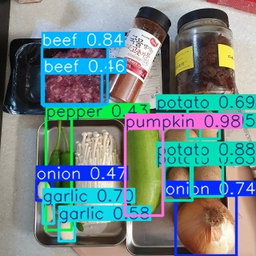

# Introduction
This is a deep learning project as a mandatory one for **the  28th zero-base Data School**.

In this project, we do as follows:
- we build and train a [YOLO v11](https://docs.ultralytics.com/models/yolo11/) model to detect various food ingredients from images (320 * 320 pixels),
- we then combine the yolo model with the OpenAI API, in order to recommend and let us know a recipe that can be made with the detected ingredients.

# Example
From the following image,



the following recipe is recommended: (in Korean)

```
냉장고에 있는 재료로 만들 수 있는 간단한 요리로는 "소고기 감자 볶음"을 추천합니다. 이 요리는 쉽고 빠르게 만들 수 있으며, 영양도 풍부합니다.

### 소고기 감자 볶음 레시피

#### 재료
- 소고기 (200g)
- 감자 (1개)
- 양파 (1개)
- 마늘 (2쪽)
- 고추 (1~2개, 기호에 따라)
- 호박 (선택 사항)
- 소금, 후추, 간장, 식용유

#### 조리 도구
- 팬 또는 프라이팬
- 도마
- 칼

#### 조리 방법

1. **재료 손질**
   - 소고기는 먹기 좋은 크기로 썰어주세요. 
   - 감자는 껍질을 벗기고 잘게 썰어줍니다. 
   - 양파는 채 썰고, 마늘은 다져주세요.
   - 고추는 씨를 제거하고 어슷하게 썰어줍니다. 
   - 호박은 선택 사항으로, 얇게 썰어주세요.

2. **소고기 볶기**
   - 프라이팬에 식용유를 두르고 중불로 가열합니다.
   - 팬이 달궈지면 다진 마늘을 넣고 향이 올라올 때까지 볶습니다.
   - 소고기를 넣고 고기가 반쯤 익을 때까지 볶아줍니다. 이때 소금과 후추로 간을 살짝 해줍니다.

3. **채소 추가**
   - 소고기가 어느 정도 익으면 감자와 양파를 넣고 볶습니다.
   - 감자가 살짝 투명해질 때까지 끓여주세요. (약 5분 정도)

4. **쥬시한 맛 내기**
   - 부족한 간을 체크 후 필요에 따라 간장으로 맛을 조절합니다.
   - 호박과 고추도 함께 넣고 모두 잘 섞어주세요.
   - 모든 재료가 고루 익을 때까지 볶아줍니다. 

5. **마무리**
   - 모든 재료가 익고 간이 잘 배어들면 불을 끄고, 접시에 담아냅니다.
   - 취향에 따라 고추를 추가하여 매운맛을 더할 수 있습니다.

### 서빙
이 요리는 밥과 함께 서빙하면 좋습니다. 기호에 따라 계란 후라이를 올려주거나, 통깨를 뿌려주면 더욱 맛있습니다.

맛있게 드세요!`
```

# Data
- We collected images from web, and resized them as 320 * 320 pixels, then we annotated labels for images using `labelme` and `labelme2yolo`.
- The `train.py` file was used to train a YOLO v11 model via 200 epochs (early stopped at the 165th epoch) with the default training options. The trained model can be found at `YOLODataset/best.pt`.
- The `main.py` file plays a role to detect ingredients in test files and to recommend a recipe.

Many thanks to collaborators for your co-operations!
